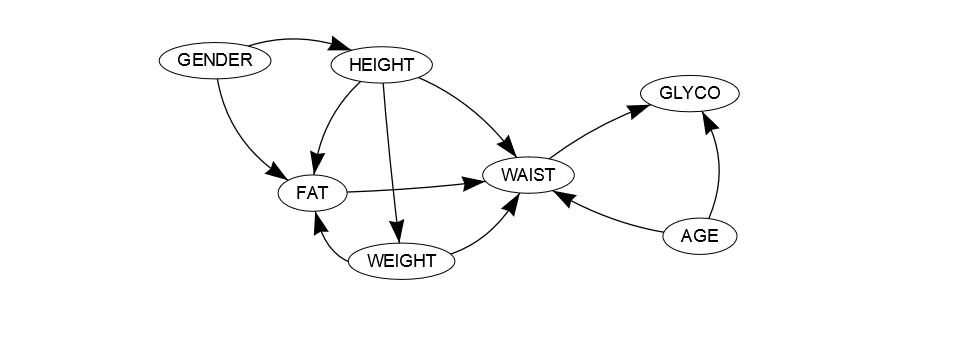

<!-- README.md is generated from README.Rmd. Please edit that file -->

```{r, include = FALSE}
knitr::opts_chunk$set(
  collapse = TRUE,
  comment = "#>",
  fig.path = "man/figures/README-",
  out.width = "100%"
)
```

# gmgm 

<!-- badges: start -->
[](https://cran.r-project.org/package=gmgm)
<!-- badges: end -->

Gaussian mixture graphical models include Bayesian networks and dynamic Bayesian networks (their temporal extension) whose local probability distributions are described by Gaussian mixture models. They are powerful tools for graphically and quantitatively representing nonlinear dependencies between continuous variables. The R package gmgm provides a complete framework to create, manipulate, learn the structure and the parameters, and perform inference in these models.

## Example

This example shows how gmgm can be used to learn the structure and the parameters of a Gaussian mixture Bayesian network:
```r
library(gmgm)
set.seed(0)

data(data_body)
obs_learn <- sample.int(2148, 1848)
data_learn <- data_body[obs_learn, ]

gmbn_init <- add_nodes(NULL,
                       c("AGE", "FAT", "GENDER", "GLYCO", "HEIGHT", "WAIST",
                         "WEIGHT"))
                         
arcs_cand <- data.frame(from = c("AGE", "GENDER", "HEIGHT", "WEIGHT", NA, "AGE",
                                 "GENDER", "AGE", "FAT", "GENDER", "HEIGHT",
                                 "WEIGHT", "AGE", "GENDER", "HEIGHT"),
                        to = c("FAT", "FAT", "FAT", "FAT", "GLYCO", "HEIGHT",
                               "HEIGHT", "WAIST", "WAIST", "WAIST", "WAIST",
                               "WAIST", "WEIGHT", "WEIGHT", "WEIGHT"))
                                  
res_learn <- struct_learn(gmbn_init, data_learn, arcs_cand = arcs_cand,
                          verbose = TRUE, max_comp = 3, max_rank = 1,
                          regul = 0.01, max_iter_em = 100)
```
```r
#> node AGE    bic_old = -1604165.22026861    bic_new = -6936.35703030545
#> node FAT    bic_old = -1101157.27026861    bic_new = -5240.27043715568
#> node GENDER    bic_old = -2188.72026861444    bic_new = 7570.83224030922
#> node GLYCO    bic_old = -32261.7452686144    bic_new = -1351.77102746833
#> node HEIGHT    bic_old = -25686922.7452686    bic_new = -6212.66741648412
#> node WAIST    bic_old = -8931942.60026862    bic_new = -5573.47194798866
#> node WEIGHT    bic_old = -6366683.95526861    bic_new = -7942.70714135656
```

The learned structure is displayed as follows:
```r
network(res_learn$gmgm)
```


Then the model can be used to perform inference:
```r
data_infer <- data_body[setdiff(1:2148, obs_learn), ]
data_infer$GENDER[sample.int(300, 100)] <- NA
data_infer$AGE[sample.int(300, 100)] <- NA
data_infer$HEIGHT[sample.int(300, 100)] <- NA
data_infer$WEIGHT[sample.int(300, 100)] <- NA
data_infer$FAT[sample.int(300, 100)] <- NA
data_infer$WAIST[sample.int(300, 100)] <- NA
data_infer$GLYCO[sample.int(300, 100)] <- NA

infer <- inference(res_learn$gmgm, data_infer)
print(infer)
```
```r
#> # A tibble: 300 x 7
#>      AGE   FAT  GENDER GLYCO HEIGHT WAIST WEIGHT
#>    <dbl> <dbl>   <dbl> <dbl>  <dbl> <dbl>  <dbl>
#>  1  31.7  31.3 0        4.9    173. 102.    88.4
#>  2  55    40.9 0.930    6.5    157. 102.    75.8
#>  3  44    31.8 0.145    5.8    166. 101.    80.2
#>  4  32.4  27.4 0        5.3    164.  90.9   79.6
#>  5  41.   39.1 1        4.6    169.  90.7   74.4
#>  6  52.   41.1 1        5.6    159.  87.4   72.2
#>  7  40.3  48.3 1        5.93   167. 119.   109. 
#>  8  48    42.1 1        6.08   172. 111.    96.5
#>  9  40    26.  1        5.2    165.  84.4   61.4
#> 10  31.   36.9 0.00688  5.3    174. 130.   128. 
#> # ... with 290 more rows
```
