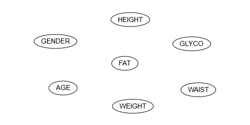
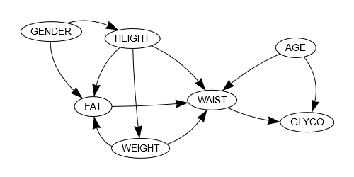
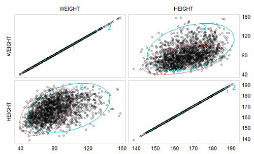

<!-- README.md is generated from README.Rmd. Please edit that file -->

# gmgm 

<!-- badges: start -->

[](https://cran.r-project.org/package=gmgm)
<!-- badges: end -->

Gaussian mixture graphical models include Bayesian networks and dynamic
Bayesian networks (their temporal extension) whose local probability
distributions are described by Gaussian mixture models. They are
powerful tools for graphically and quantitatively representing nonlinear
dependencies between continuous variables. The R package gmgm provides a
complete framework to create, manipulate, learn the structure and the
parameters, and perform inference in these models.

## Example

The following example illustrates how gmgm can be used to learn the
structure, the parameters and perform inference in a Gaussian mixture
Bayesian network.

Let’s take the NHANES dataset provided in this package, which includes
body composition data measured in 2148 adults aged 20 to 59 years in the
United States. 1848 observations are randomly chosen as the training
set, while the 300 remaining ones are chosen as the test set. In the
latter, one-third of the values of each column are randomly removed:

``` r
library(gmgm)
set.seed(0)

data(data_body)
obs_train <- sample.int(2148, 1848)
data_train <- data_body[obs_train, ]
data_test <- data_body[setdiff(1:2148, obs_train), ]

data_test_na <- data_test
data_test_na$GENDER[sample.int(300, 100)] <- NA
data_test_na$AGE[sample.int(300, 100)] <- NA
data_test_na$HEIGHT[sample.int(300, 100)] <- NA
data_test_na$WEIGHT[sample.int(300, 100)] <- NA
data_test_na$FAT[sample.int(300, 100)] <- NA
data_test_na$WAIST[sample.int(300, 100)] <- NA
data_test_na$GLYCO[sample.int(300, 100)] <- NA

print(data_test_na)

#> # A tibble: 300 x 8
#>       ID GENDER   AGE HEIGHT WEIGHT   FAT WAIST GLYCO
#>    <int>  <int> <int>  <dbl>  <dbl> <dbl> <dbl> <dbl>
#>  1 93731      0    NA    NA    NA    31.3 102.    4.9
#>  2 93758     NA    55   157.   75.8  NA   102.    6.5
#>  3 93761     NA    44   166.   80.2  31.8  NA     5.8
#>  4 93811      0    NA   164.   79.6  NA    90.9   5.3
#>  5 93814      1    41   169.   NA    39.1  90.7   4.6
#>  6 93824      1    52   159.   72.2  41.1  87.4   5.6
#>  7 93837      1    NA   167.  109.   48.3  NA    NA  
#>  8 93841      1    48   172.   96.5  NA    NA    NA  
#>  9 93849      1    40   165.   61.4  26    84.4   5.2
#> 10 93926     NA    31    NA    NA    36.9 130.    5.3
#> # ... with 290 more rows
```

At first, the Bayesian network is initialized with nodes corresponding
to the variables of the dataset and no arc:

``` r
gmbn_init <- add_nodes(NULL,
                       c("AGE", "FAT", "GENDER", "GLYCO", "HEIGHT", "WAIST",
                         "WEIGHT"))

network(gmbn_init)
```



Starting from this initial structure, the training set is used to select
the best subset of arcs (among predefined candidate arcs) and estimate
the parameters of each local Gaussian mixture model:

``` r
arcs_cand <- data.frame(from = c("AGE", "GENDER", "HEIGHT", "WEIGHT", NA, "AGE",
                                 "GENDER", "AGE", "FAT", "GENDER", "HEIGHT",
                                 "WEIGHT", "AGE", "GENDER", "HEIGHT"),
                        to = c("FAT", "FAT", "FAT", "FAT", "GLYCO", "HEIGHT",
                               "HEIGHT", "WAIST", "WAIST", "WAIST", "WAIST",
                               "WAIST", "WEIGHT", "WEIGHT", "WEIGHT"))
                                  
res_learn <- struct_learn(gmbn_init, data_train, arcs_cand = arcs_cand,
                          verbose = TRUE, max_comp = 3)

#> node AGE    bic_old = -1604165.22026861    bic_new = -6936.35703030545
#> node FAT    bic_old = -1101157.27026861    bic_new = -5240.27043715568
#> node GENDER    bic_old = -2188.72026861444    bic_new = 7570.83224030922
#> node GLYCO    bic_old = -32261.7452686144    bic_new = -1351.77102746833
#> node HEIGHT    bic_old = -25686922.7452686    bic_new = -6212.66741648412
#> node WAIST    bic_old = -8931942.60026862    bic_new = -5573.47194798866
#> node WEIGHT    bic_old = -6366683.95526861    bic_new = -7942.70714135656
```

The final structure contains 11 arcs:

``` r
network(res_learn$gmgm)
```



If we focus for example on the variable WEIGHT, we can see that it
directly depends on the variable HEIGHT. In the related local Gaussian
mixture model, an optimal number of two mixture components has been
selected:

``` r
print(res_learn$gmgm$WEIGHT)

#> $alpha
#> [1] 0.6200512 0.3799488
#> 
#> $mu
#>             [,1]     [,2]
#> WEIGHT  70.78853  96.3321
#> HEIGHT 165.24341 168.4551
#> 
#> $sigma
#> $sigma[[1]]
#>           WEIGHT   HEIGHT
#> WEIGHT 169.32464 57.37758
#> HEIGHT  57.37758 84.23874
#> 
#> $sigma[[2]]
#>           WEIGHT   HEIGHT
#> WEIGHT 395.43744 64.55256
#> HEIGHT  64.55256 86.69264
#> 
#> 
#> attr(,"class")
#> [1] "gmm"
```

Graphically, we observe that these mixture components fit well with the
training data:

``` r
ellipses(res_learn$gmgm$WEIGHT, data_train)
```



Now that the Bayesian network has been learned, it can be used to
perform inference on the test set, which allows to fill in the missing
values:

``` r
data_infer <- inference(res_learn$gmgm, data_test_na)

print(data_infer)

#> # A tibble: 300 x 7
#>      AGE   FAT  GENDER GLYCO HEIGHT WAIST WEIGHT
#>    <dbl> <dbl>   <dbl> <dbl>  <dbl> <dbl>  <dbl>
#>  1  31.7  31.3 0        4.9    173. 102.    88.4
#>  2  55    40.9 0.930    6.5    157. 102.    75.8
#>  3  44    31.8 0.145    5.8    166. 101.    80.2
#>  4  32.4  27.4 0        5.3    164.  90.9   79.6
#>  5  41.   39.1 1        4.6    169.  90.7   74.4
#>  6  52.   41.1 1        5.6    159.  87.4   72.2
#>  7  40.3  48.3 1        5.93   167. 119.   109. 
#>  8  48    42.1 1        6.08   172. 111.    96.5
#>  9  40    26.  1        5.2    165.  84.4   61.4
#> 10  31.   36.9 0.00688  5.3    174. 130.   128. 
#> # ... with 290 more rows
```

Focusing back on the variable WEIGHT, the values have been filled in
with a mean absolute percentage error (MAPE) of 10.2%:

``` r
pred_weight <- data_infer$WEIGHT[is.na(data_test_na$WEIGHT)]
actual_weight <- data_test$WEIGHT[is.na(data_test_na$WEIGHT)]

mape <- mean(abs(pred_weight - actual_weight) / actual_weight)

print(mape)

#> [1] 0.101956
```
